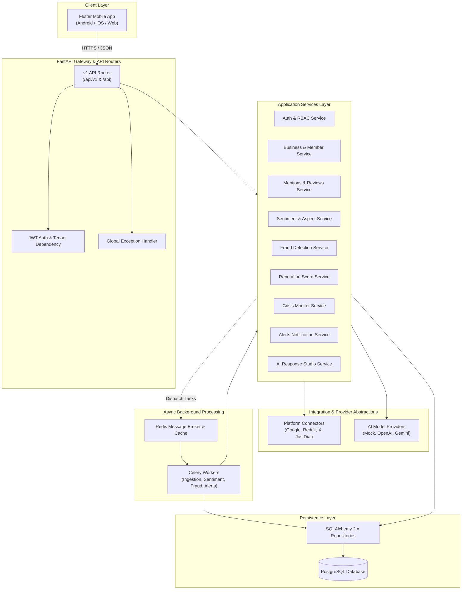
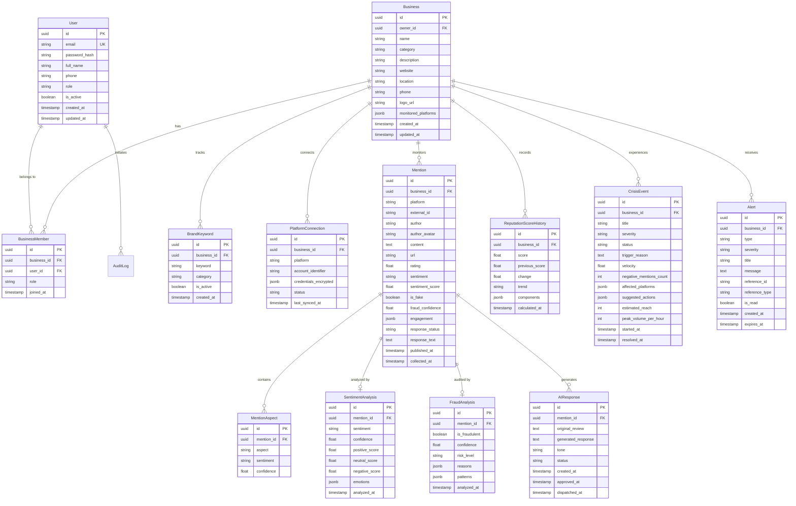

# RepuTex Backend Architecture Specification

## 1. Executive Summary & Philosophy

**RepuTex** is an AI-powered reputation monitoring, intelligence, and crisis-prevention platform for SMBs and enterprise businesses. 

The backend is architected as a clean, performant **Modular Monolith** using **FastAPI**, **SQLAlchemy 2.x (Async)**, **PostgreSQL**, **Redis**, and **Celery**. 

### Architectural Tenets
1. **Strict Modular Monolith**: No microservice network overhead. All domain boundaries are maintained via isolated Python packages (`api/`, `services/`, `repositories/`, `models/`, `integrations/`, `ai/`, `workers/`).
2. **Unidirectional Dependency Flow**:
   $$\text{Flutter Mobile (HTTPS)} \longrightarrow \text{FastAPI Routes} \longrightarrow \text{Domain Services} \longrightarrow \text{Repositories} \longrightarrow \text{PostgreSQL}$$
   - Routes **never** contain SQL queries or business logic.
   - Flutter **never** accesses PostgreSQL directly.
3. **Guaranteed Multi-Tenant Isolation**: Every database query scoped to a business validates membership/ownership. ID spoofing is strictly impossible.
4. **Resilient Dual-Mode Operation**: Backends can run fully offline in `MOCK` mode with deterministic, realistic data, or seamlessly switch to live `REAL` providers (Google Places/Business, Reddit API, X API, JustDial scrapers, OpenAI/Gemini/Anthropic AI providers) without altering route or service contracts.

---

## 2. High-Level System Architecture



---

## 3. Technology Stack Specification

| Layer | Component / Tool | Rationale & Configuration |
| :--- | :--- | :--- |
| **Language** | Python 3.12+ | Native high-performance async/await, modern type hinting (`type \| None`). |
| **Framework** | FastAPI 0.115+ | High throughput ASGI, native OpenAPI 3.1 documentation, dependency injection. |
| **Schemas** | Pydantic v2 | Sub-millisecond validation and serialization via Rust core; explicit aliasing. |
| **ORM & DB Access** | SQLAlchemy 2.0+ (Async) | Async session with `asyncpg` driver; clean unit-of-work and query construction. |
| **Database** | PostgreSQL 16+ | ACID compliance, JSONB for flexible platform metadata, robust relational constraints. |
| **Migrations** | Alembic | Fully typed schema versioning and autogeneration linked to SQLAlchemy metadata. |
| **Cache & Queue** | Redis 7+ | Lightning-fast message broker for Celery and in-memory rate limiting / session caching. |
| **Background Tasks**| Celery 5.4+ | Distributed task queue for non-blocking scraping, sentiment NLP, and fraud clustering. |
| **Security** | Argon2id & PyJWT | Password hashing with memory-hard Argon2id (`argon2-cffi`), tamper-proof RS256/HS256 JWTs. |
| **HTTP Client** | HTTPX (Async) | Non-blocking HTTP requests for external platform webhooks and AI model APIs. |
| **Testing** | pytest + pytest-asyncio | Fully automated unit, integration, and tenant isolation test suites. |
| **Containerization**| Docker & Docker Compose | Self-contained, multi-container local and production deployment. |

---

## 4. Database Schema & Entity Relationships



---

## 5. Domain Services & Algorithms

### 5.1 Reputation Scoring Engine (`reputation_service.py`)
RepuTex calculates an explainable composite reputation score scaled from **0 to 100**.

$$\text{ReputationScore} = \left( w_r \cdot S_{\text{rating}} + w_s \cdot S_{\text{sentiment}} + w_v \cdot S_{\text{volume}} + w_{\text{resp}} \cdot S_{\text{response}} \right) - \left( P_{\text{fraud}} + P_{\text{crisis}} \right)$$

Where:
1. **Rating Component ($S_{\text{rating}}$, weight $w_r = 0.40$)**: Normalized star rating $\frac{\overline{R}}{5.0} \times 100$.
2. **Sentiment Component ($S_{\text{sentiment}}$, weight $w_s = 0.30$)**: Ratio of positive vs negative mentions:
   $$S_{\text{sentiment}} = \left( \frac{\text{Pos} + 0.5 \cdot \text{Neu}}{\text{Total}} \right) \times 100$$
3. **Volume Component ($S_{\text{volume}}$, weight $w_v = 0.15$)**: Scaled logarithm of mention activity relative to rolling 30-day baseline.
4. **Response Engagement ($S_{\text{resp}}$, weight $w_{\text{resp}} = 0.15$)**: Percentage of negative reviews answered within 24 hours.
5. **Fraud Penalty ($P_{\text{fraud}}$)**: Up to $-15$ deduction proportional to confirmed fraudulent review count.
6. **Crisis Drag ($P_{\text{crisis}}$)**: Active crisis penalty ($-10$ for High, $-20$ for Critical).

Historical recalculation snapshots are recorded whenever new mentions are ingested or on-demand via `POST /api/v1/reputation/recalculate`.

---

### 5.2 Explainable Fraud Detection Engine (`fraud_service.py`)
Analyzes incoming mentions and reviews against deterministic behavioral rules:
1. **Review Burst Detection**: Flags $\ge 3$ negative or positive reviews on the same platform within a 15-minute rolling window.
2. **Syntactic & Text Duplication**: Levenshtein/Jaccard similarity $\ge 0.85$ compared with reviews across other accounts.
3. **Account Freshness Anomaly**: Evaluates platform author metadata (account created $< 24$ hours prior to review).
4. **Rating-Sentiment Inversion**: 1-star rating paired with overtly positive copy or 5-star rating with severe negative complaints.

Output yields `risk_level` (`low`, `medium`, `high`, `critical`), `confidence` (0.0 to 1.0), and human-auditable `reasons` and `patterns` matching Flutter's `FraudResult`.

---

### 5.3 Crisis Detection & Monitoring Engine (`crisis_service.py`)
Runs automatically during ingestion or via scheduled Celery beat:
- Monitors **velocity** (negative mentions per hour).
- If velocity exceeds business threshold (default: $\ge 8$ negative mentions/hour) OR negative sentiment ratio surpasses 40% in a 4-hour window:
  1. Instantiates or escalates an active `CrisisEvent`.
  2. Generates suggested mitigation action items.
  3. Emits a high-severity `Alert` visible on Flutter's `/alerts` and `/crisis` screens.

---

### 5.4 AI Response Studio Engine (`ai_service.py`)
Provides prompt templates parameterized by tone:
- `empathetic`: Apologetic, restorative, offers direct human contact.
- `professional`: Calm, corporate, outlines internal management audit.
- `firm`: Fact-based, requests transaction proof or order verification.
- `promotional`: Enthusiastic, invites customer back, highlights specialties.

Under `MOCK` mode, generates contextual, high-fidelity responses deterministically. Under `REAL` mode, invokes configured LLM provider (OpenAI, Gemini, Anthropic) via asynchronous streaming or single-call completions.

---

## 6. Multi-Tenant Authorization & Security Model

1. **Owner / Member Isolation**:
   - `BusinessMember` associates `user_id` with `business_id` and assigned role.
   - FastAPI dependency `get_current_business(user, business_id=None)` verifies that `user` is an active member or owner of the target business.
   - If a user passes an ID belonging to another business, the API yields `403 Forbidden (BUSINESS_ACCESS_DENIED)` or `404 Not Found`.
2. **Password Security**:
   - Argon2id with 64MB memory cost, 3 iterations, 4 parallelism.
   - Plaintext passwords never log or persist.
3. **Token Management**:
   - Access tokens signed with secret key.
   - Refresh tokens stored in hashed format in database and invalidated on logout or rotation.
4. **Input Sanitization**:
   - Pydantic models strip dangerous tags and enforce strict typing.

---

## 7. Background Worker Architecture (Celery + Redis)

```text
[Celery Beat Scheduler]
       │
       ├─► Every 5m:  `tasks.poll_platform_mentions`
       ├─► Every 10m: `tasks.run_fraud_clustering`
       ├─► Every 15m: `tasks.recalculate_reputation_scores`
       └─► Every 5m:  `tasks.evaluate_crisis_triggers`

[Incoming Webhooks / Ingestion]
       │
       ▼
[Redis Broker: reputex_queue]
       │
       ▼
[Celery Worker Pool]
       ├─► Worker 1: Ingestion & Normalization
       ├─► Worker 2: Sentiment & Aspect NLP Analysis
       └─► Worker 3: Fraud Signal Scoring & Alert Generation
```

Workers execute idempotently without blocking HTTP request threads.

---

## 8. Directory Structure & Layout

```text
backend/
├── app/
│   ├── __init__.py
│   ├── main.py                     # FastAPI application factory, CORS, exception handlers
│   │
│   ├── api/
│   │   ├── __init__.py
│   │   └── v1/
│   │       ├── __init__.py
│   │       ├── router.py           # Aggregated v1 API router & /api backward-compatible aliases
│   │       ├── auth.py             # Login, register, refresh, me, logout
│   │       ├── businesses.py       # Business CRUD & setup onboarding
│   │       ├── keywords.py         # Brand keyword management
│   │       ├── dashboard.py        # Dashboard summary, score, sentiment, trends, platforms
│   │       ├── mentions.py         # Paginated mentions feed & review details
│   │       ├── sentiment.py        # Sentiment analytics & aspect sentiment
│   │       ├── fraud.py            # Fraud reviews & suspicious pattern inspection
│   │       ├── reputation.py       # Reputation scoring & history
│   │       ├── crisis.py           # Crisis events, active crisis, escalation
│   │       ├── alerts.py           # Notification alerts, mark-as-read
│   │       ├── ai_response.py      # AI response generation, approval, dispatch
│   │       └── devices.py          # FCM device token registration
│   │
│   ├── core/
│   │   ├── __init__.py
│   │   ├── config.py               # Pydantic Settings (.env, DATABASE_URL, JWT_SECRET, etc.)
│   │   ├── database.py             # Async SQLAlchemy engine & sessionmaker
│   │   ├── security.py             # Argon2 password hashing, JWT encode/decode
│   │   ├── logging.py              # Structured JSON logging
│   │   ├── exceptions.py           # AppException hierarchy & error code constants
│   │   └── dependencies.py         # Current user, active business, DB session dependencies
│   │
│   ├── models/                     # SQLAlchemy 2.x ORM models
│   │   ├── __init__.py
│   │   ├── user.py
│   │   ├── business.py
│   │   ├── platform.py
│   │   ├── mention.py
│   │   ├── sentiment.py
│   │   ├── fraud.py
│   │   ├── reputation.py
│   │   ├── crisis.py
│   │   ├── alert.py
│   │   ├── ai_response.py
│   │   └── device.py
│   │
│   ├── schemas/                    # Pydantic v2 validation models
│   │   ├── __init__.py
│   │   ├── auth.py
│   │   ├── business.py
│   │   ├── keyword.py
│   │   ├── dashboard.py
│   │   ├── mention.py
│   │   ├── sentiment.py
│   │   ├── fraud.py
│   │   ├── crisis.py
│   │   ├── alert.py
│   │   └── ai_response.py
│   │
│   ├── repositories/               # Async Data Access Layer (CRUD & Queries)
│   │   ├── __init__.py
│   │   ├── base.py
│   │   ├── user_repository.py
│   │   ├── business_repository.py
│   │   ├── mention_repository.py
│   │   ├── fraud_repository.py
│   │   ├── crisis_repository.py
│   │   ├── alert_repository.py
│   │   └── ai_response_repository.py
│   │
│   ├── services/                   # Core Business Logic Layer
│   │   ├── __init__.py
│   │   ├── auth_service.py
│   │   ├── business_service.py
│   │   ├── dashboard_service.py
│   │   ├── mention_service.py
│   │   ├── sentiment_service.py
│   │   ├── fraud_service.py
│   │   ├── reputation_service.py
│   │   ├── crisis_service.py
│   │   ├── alert_service.py
│   │   └── ai_service.py
│   │
│   ├── integrations/               # External Platform Connectors
│   │   ├── __init__.py
│   │   ├── base.py                 # PlatformConnector abstract interface
│   │   ├── mock_connector.py       # Deterministic realistic mock platform connector
│   │   ├── google.py               # Google Places / Business Profile skeleton
│   │   ├── reddit.py               # Reddit API skeleton
│   │   ├── twitter.py              # X API skeleton
│   │   └── justdial.py             # JustDial crawler skeleton
│   │
│   ├── ai/                         # AI Provider Abstraction
│   │   ├── __init__.py
│   │   ├── base.py                 # AIProvider abstract interface
│   │   ├── mock_ai.py              # Deterministic mock AI provider
│   │   └── gemini_ai.py            # Gemini API provider
│   │
│   └── workers/                    # Celery Background Tasks
│       ├── __init__.py
│       ├── celery_app.py
│       └── tasks.py
│
├── migrations/                     # Alembic migration scripts
│   ├── env.py
│   └── versions/
│
├── tests/                          # Automated Pytest Suite
│   ├── __init__.py
│   ├── conftest.py
│   ├── test_auth.py
│   ├── test_businesses.py
│   ├── test_mentions.py
│   ├── test_reputation.py
│   ├── test_fraud.py
│   ├── test_crisis.py
│   ├── test_alerts.py
│   ├── test_ai_responses.py
│   └── test_tenant_isolation.py
│
├── scripts/
│   └── seed.py                     # High-fidelity deterministic database seeding
│
├── Dockerfile
├── docker-compose.yml
├── requirements.txt
├── .env.example
├── alembic.ini
├── README.md
├── ARCHITECTURE.md
└── API_CONTRACT.md
```
